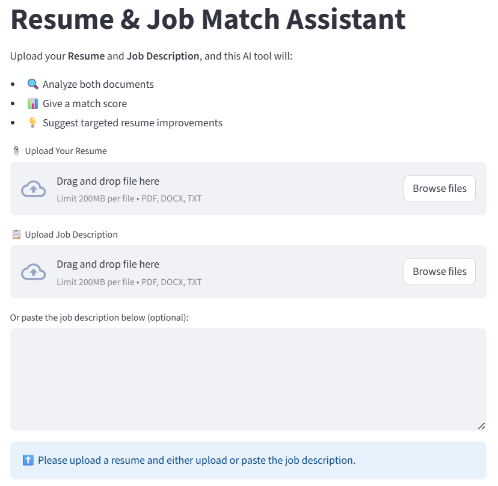

# Resume Match AI Assistant

**An AI-powered tool to evaluate and improve resume–job description (JD) alignment.**  
Built with Streamlit and Gemini Pro (Google AI), this assistant enhances resume targeting by providing tailored insights based on job requirements, helping increase the chances of landing interviews.

The Resume Match AI Assistant enables users to:
- Upload a resume and a job description (or paste JD text)
- Generate an AI-driven **match score** (out of 100)
- View a concise **summary** of resume-job fit
- Extract the **top 10 job requirements** mentioned in the JD
- Receive **custom improvement suggestions** to optimize the resume
- Export all findings to a clean, printable **PDF report**

Designed for job seekers and professionals aiming to streamline the job application process, this tool offers clarity, speed, and intelligent feedback, helping resumes stand out in a competitive market without the need for guesswork.


## Table of Contents
- [Project Goals & Use Cases](#project-goals--use-cases)
- [Choosing the AI Model](#choosing-the-ai-model)
- [Dataset & Parsing Strategy](#dataset--parsing-strategy)
- [Project Structure](#project-structure)
- [Tech Stack & Dependencies](#tech-stack--dependencies)
- [How to Run the App](#how-to-run-the-app)
- [Output Format](#output-format)
- [Limitations](#limitations)
- [Future Work](#future-work)
- [License](#license)


## Project Goals & Use Cases
The Resume Match AI Assistant is designed to help job seekers optimize their resumes based on specific job descriptions without relying on manual edits or guesswork. Its main goals are:

- **Automate resume tailoring** by comparing resume content with job descriptions using LLMs.
- **Improve applicant visibility** by aligning resumes with employer-stated requirements.
- **Save time and reduce friction** in the job application process by delivering actionable insights in seconds.
- **Support early-career professionals**, career switchers, or anyone applying to roles in competitive industries.

### Example Use Cases:
- Preparing a tailored resume before applying to roles.
- Evaluating how well a generic resume aligns with specific job listings.
- Identifying gaps or weak areas before a resume reaches an Applicant Tracking System (ATS).
- Getting quick feedback when applying to roles in different domains (e.g., Product vs. Data roles).


## Choosing the AI Model
This project was initially prototyped using **OpenAI’s GPT-4 API**, a popular and highly capable large language model (LLM). However, after evaluating multiple LLMs, including factors like accessibility, cost, onboarding barriers, and suitability for open-source or student users, the tool transitioned to **Gemini Pro** (Google AI).

The goal was to ensure a **plug-and-play experience** for users without requiring credit card setup or complex deployment steps. Gemini offers a generous free tier (30 requests/day) with only a Google account, making it ideal for individual contributors, learners, and public demos.

### Why Gemini?
- **No credit card required** for free-tier access  
- **30 requests per day** with a free Google account  
- **No usage cost** unless quota is exceeded  
- **Simpler onboarding** for open-source users

By comparison, OpenAI’s API requires billing setup even for free use, which can be a barrier for casual or student users.

### Model Comparison
| Feature                | **Gemini Pro (Google AI)**           | **OpenAI GPT-4 (API)**                | **Claude 3 (Anthropic)**                 |
| ---------------------- | ------------------------------------ | ------------------------------- | ---------------------------------------- |
| **Free Tier Access**   | 30 req/day (Gemini 2.5)              | ChatGPT web only (no free API)              | No free API tier                           |
| **Requires Card Info** | No                                   | Yes (even for free token use)              | Yes (via Claude.ai or AWS)                 |
| **Latency**            | Fast (\~2–3s avg)                    | Moderate (\~4–6s avg)              | Moderate (\~5–7s avg)                      |
| **Rate Limits**        | 30/day (Free), 60/min (Pro)          | Token quotas by tier              | Limited by AWS plan or Claude tier         |
| **Regional Access**    | Most regions supported               | Most regions (some restricted)       | Varies by provider (Claude.ai, AWS)        |
| **Pricing**            | Free → Paid                          | Paid (e.g., \$0.01–\$0.03/1K tokens)           | Paid (Opus \~\$15/1M tokens via AWS)       |
| **Official Docs**      | [Gemini Docs](https://ai.google.dev/gemini-api/docs) | [OpenAI Docs](https://platform.openai.com/docs)  | [Claude Docs](https://docs.anthropic.com/) |

### Flexibility to Switch
The app is built modularly, making it easy to switch between LLMs depending on your access and preferences. While Gemini Pro is the default AI engine, users with access to **OpenAI’s GPT-4 API**, **Claude**, or other LLMs can substitute Gemini by updating the backend logic.

To switch to a different model:
- Replace the implementation in `utils/gemini_analysis.py` with your preferred LLM's prompt and response handling code.
- No changes are needed to the UI or result parser, as the app expects a standardized markdown format in return.


## Dataset & Parsing Strategy
This project does **not use a pre-collected dataset**. Instead, it processes **user-uploaded resumes** and **job descriptions** at runtime, treating them as live input to extract meaningful features for AI analysis.

### Supported File Types
- **Resume:** PDF, DOCX, or plain text  
- **Job Description:** PDF, DOCX, plain text, or direct text input  

### Parsing Strategy
To support a wide range of resume/job formats and maintain modularity, the tool uses format-specific parsers:

| File Type | Parser Used       | Library                       |
|-----------|-------------------|-------------------------------|
| PDF       | Text extraction   | `PyMuPDF`                     |
| DOCX      | Native parsing    | `python-docx`                 |
| TXT       | Plain text reader | Python built-in `open()`      |

### Preprocessing
Before sending content to the AI model:
- Line breaks and excessive whitespace are cleaned  
- Non-textual elements (tables, headers/footers, etc.) are stripped  
- Resume and job description content is trimmed if excessively long  

This parsing strategy ensures the AI receives clean, structured context from both documents to maximize relevance and accuracy of its analysis.


## Project Structure
The codebase is organized for modularity and ease of extension. Below is an overview of the main directories and files:
```bash
ResumeMatchAIAssistant/
├── .streamlit/
│ └── secrets.toml.example          ← Example file for API key config
│
├── assets/                         ← Image assets (e.g. for README)
├── output/                         ← Saved analysis reports (PDFs)
├── utils/                          ← Modular Python scripts
│ ├── file_parser.py                ← Resume & JD file/text extractors
│ ├── gemini_analysis.py            ← Gemini API interaction logic
│ ├── result_parser.py              ← Parses markdown into structured sections
│ └── save_to_pdf.py                ← Converts AI output to PDF
│
├── .dockerignore                   ← Ignore files during Docker build
├── .gitignore                      ← Ignore local/dev files for Git
├── app.py                          ← Streamlit main app
├── Dockerfile                      ← Container image definition
├── docker-compose.yml              ← Dev-friendly container run config
├── requirements.txt                ← Python dependencies
└── README.md                       ← You’re here!
```

Each module is built for plug-and-play functionality, making the app easy to customize or extend with other LLMs or export formats.


## Tech Stack & Dependencies
This project combines modern web frameworks, AI APIs, and document parsing tools to build an intuitive and portable resume analysis assistant.

### Core Technologies
- **[Streamlit](https://streamlit.io/)** – Python-based web framework for rapid app development  
- **[Gemini Pro API](https://ai.google.dev/)** – Large Language Model (LLM) from Google, used for match scoring and analysis  
- **[Python](https://www.python.org/)** 3.12 – Core programming language

### Document Parsing Libraries
- [`python-docx`](https://python-docx.readthedocs.io/) – Parse DOCX resumes and job descriptions  
- [`PyMuPDF`](https://pymupdf.readthedocs.io/) – Lightweight PDF reader for fallback PDF parsing

### PDF Export
- [`markdown2`](https://github.com/trentm/python-markdown2) – Converts AI output (markdown) to HTML  
- [`xhtml2pdf`](https://github.com/xhtml2pdf/xhtml2pdf) – Lightweight tool to convert HTML to PDF without system dependencies

### Deployment
- **Docker** – Containerization for reproducible, system-agnostic setup  
- **Docker Compose** – Simplifies mounting secrets and running the app with one command  

### Requirements
All dependencies are listed in [`requirements.txt`](./requirements.txt), and a Dockerized version is available to avoid system-specific installations.


## How to Run the App
This project supports both local (non-Docker) and Dockerized workflows. Before launching, you'll need an API key from Google Gemini.
 
### 1. Get a Gemini API Key (Free)
To use Gemini Pro (by Google AI), create a free API key from: https://aistudio.google.com/app/apikey

> *Note:*  
> You must be logged into your Google account.  
> Gemini’s free tier includes **30 requests/day** without requiring a credit card.

### 2. API Key Setup
- Clone the repository:
  ```bash
  git clone https://github.com/janithpe/ResumeMatchAIAssistant.git
  cd ResumeMatchAIAssistant
  ```

- Open `.streamlit/secrets.toml.example` and replace the placeholder with your Gemini API key:
  ```toml
  GEMINI_API_KEY = "your-gemini-api-key-here"
  ```

- Save the file and rename it to:
  ```bash
  mv .streamlit/secrets.toml.example .streamlit/secrets.toml
  ```

> ***Important:***  
> Never share your API key or commit the `secrets.toml` file to version control.

### 3. Run Application
#### 3.1 Run Locally (Without Docker)
*Prerequisites:* Python 3.9+ installed, and install required dependencies from `requirements.txt`

- Launch the app
  ```bash
  streamlit run app.py
  ```

#### 3.2 Run via Docker (Recommended)
Use Docker to avoid setting up Python or dependencies locally.

*Prerequisites:* Install [Docker Desktop](https://www.docker.com/products/docker-desktop/)

- Build and launch container:
  ```bash
  docker compose -f docker-compose.yml up --build
  ```

After **3.1** or **3.2**, visit the dashboard in your browser:
```bash
http://localhost:8501
```
> Example view  



## Output Format
After processing the uploaded resume and job description, the app presents a clear and structured output to help users evaluate and improve alignment:

### 1. Match Score
- A **numerical score out of 100** is generated to reflect how well a resume aligns with a specific job description.
- Scoring tiers are visually flagged:
  - 🔥 90+ Excellent match  
  - ✅ 80–89 Good match  
  - ⚠️ Below 80 Needs improvement

### 2. Summary & Top Requirements
- A concise **AI-generated summary** describes how well the resume fits the role.
- Extracted **Top 10 job requirements or keywords** from the JD are listed to highlight major focus areas.

### 3. Improvement Suggestions
- Tailored recommendations are provided to help enhance the resume.
- Suggestions may include missing skills, formatting tips, or rewording for alignment.

### 4. PDF Report Export
- A **Save** button allows exporting all insights into a cleanly formatted PDF file.
- Report includes:
  - Match Score
  - Summary
  - Top Requirements
  - Resume Suggestions
- Saved in the `output/` folder as: `analysis_YYYYMMDD_HHMMSS.pdf`

> No external viewer is required. Reports are lightweight and easily printable.


## Limitations
While Resume Match AI Assistant provides helpful guidance, it’s important to be aware of the current limitations:

### 1. Daily API Quota
- The free **Gemini API** plan allows **30 requests per day**.
- Users exceeding this limit must wait 24 hours or upgrade to a paid tier.
- The app does not currently track quota usage, so users should manage this externally.

### 2. Markdown-to-PDF Conversion
- PDF export uses a **minimal converter** that transforms markdown into plain-text-style PDFs.
- This avoids system-level dependencies and keeps both **local and Docker setups lightweight**.
- More powerful libraries like `WeasyPrint`, `pdfkit`, or `ReportLab` were **intentionally not used** to avoid requiring extra installations (e.g., `libpango`, `wkhtmltopdf`) that may be complex or platform-specific.
- As a result:
  - Output formatting is basic (headings, bullets, no styling).
  - Tables and advanced layouts are not supported.

> This tradeoff ensures ease of use and compatibility across systems, especially in containerized environments.

### 3. No Resume Rewriting
- The app offers improvement **suggestions only**.
- It does **not rewrite** or restructure resumes automatically.

### 4. AI Output Can Vary
- Suggestions are based on generative AI and may vary slightly across runs.
- Always use human judgment before applying changes.

### 5. Local-Only PDF Storage
- Exported reports are saved **locally to the `/output` folder**.
- There is no cloud or share feature implemented yet.

> These limitations ensure the project remains lightweight, easy to deploy, and free for most users.


## Future Work
While the Resume Match AI Assistant provides a complete and user-friendly experience, several enhancements are planned or considered for future development:

### 1. Improved PDF Formatting
- Explore optional use of advanced libraries like **WeasyPrint** or **pdfkit** for users comfortable installing system-level dependencies.
- Enable toggles for **styled PDF exports** or downloading analysis as **Markdown/HTML**.

### 2. Resume Tailoring Recommendations
- Add section-wise feedback (e.g., missing keywords in Experience vs. Skills sections).
- Suggest sentence rewrites or bullet enhancements using AI for specific improvements.

### 3. Multi-Job Comparison
- Allow uploading multiple job descriptions.
- Highlight **overlapping keywords** and help tailor a single resume to match multiple job roles.

### 4. OpenAI/Gemini Model Switching
- Add dropdown to choose between **Gemini**, **GPT-4**, or other models at runtime.
- Load respective API key from `.streamlit/secrets.toml` based on user selection.

### 5. User Upload History (Local Only)
- Save uploaded resumes, JDs, and previous match results locally for offline reference.
- Optional login-free session history tracking in browser.


## License
This project is intended for **educational and personal portfolio demonstration purposes only.**  
It does **not** use any proprietary datasets — all inputs are user-provided and analyzed via the **Gemini Pro API** from Google AI.

No commercial use or redistribution is permitted.
<br>
<br>

---

**Authored by:** *Janith Perera*  
M.S. in Data Science | [LinkedIn](https://www.linkedin.com/in/janith-perera-3941821a2/)

> Contributions, feedback, or suggestions are welcome.  
> If you found this project helpful, consider ⭐ starring the repository!